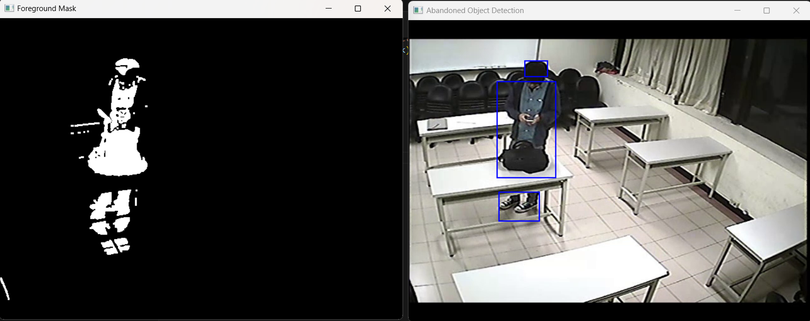
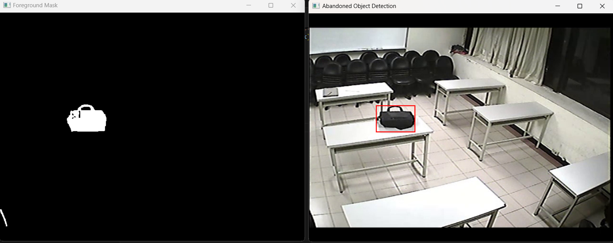

# Abandoned Object Detection (AOD)

This project implements a simple abandoned object detection system using computer vision techniques in Python. It processes video frames to identify static objects that have been left unattended for a specified period, marking them as "abandoned".

## Features

- **Background Subtraction:** Uses a custom grayscale and Gaussian blur to model the background.
- **Object Detection:** Detects moving and static objects using contour analysis.
- **Abandonment Detection:** Tracks objects and marks them as "abandoned" if they remain static for a configurable number of frames.
- **Visualization:** Draws bounding boxes and labels on detected objects, and displays both the processed frame and the foreground mask.

## Requirements

- Python 3.7+
- [OpenCV](https://opencv.org/) (`opencv-python`)
- [NumPy](https://numpy.org/`)

Install dependencies with:

```bash
pip install opencv-python numpy
```

## Usage

1. Place your video file (e.g., `video11.mp4`) in the project directory.
2. Run the main script:

```bash
python main.py
```

3. The program will open two windows:
   - **Abandoned Object Detection:** Shows the video with bounding boxes and labels.
   - **Foreground Mask:** Shows the binary mask of detected foreground objects.

Press `Esc` to exit.

## How It Works

1. **Preprocessing:** Each frame is converted to grayscale and blurred to reduce noise.
2. **Background Modeling:** The first frame is used as the background model.
3. **Foreground Extraction:** The absolute difference between the current frame and the background is thresholded to extract moving objects.
4. **Morphological Opening:** Removes small noise using erosion and dilation.
5. **Contour Detection:** Finds contours in the mask and filters out small areas.
6. **Object Tracking:** Each detected object's center is tracked across frames. If an object remains static for more than `ABANDON_THRESHOLD_FRAMES` (default: 100), it is marked as "Abandoned".
7. **Visualization:** Bounding boxes are drawn in red for abandoned objects and blue for tracking objects.

## Configuration

You can adjust the following parameters in `main.py`:

- `FRAME_WIDTH`, `FRAME_HEIGHT`: Resize video frames for processing.
- `ABANDON_THRESHOLD_FRAMES`: Number of frames an object must remain static to be considered abandoned.
- `MIN_CONTOUR_AREA`: Minimum area for a contour to be considered an object.

## Limitations

- The background model is static (first frame only); moving backgrounds may cause false positives.
- Simple tracking based on object center; overlapping or occluded objects may not be tracked robustly.
- Designed for demonstration and educational purposes, not for production use.

## Example Output

Below are sample output images from the detection system:

### Abandoned Object Detection Window



### Foreground Mask Window



- **Blue Box:** Object is being tracked.
- **Red Box:** Object is considered abandoned.

## File Structure

- `main.py`: Main detection script.
- `README.md`: Project documentation.

## License

This project is provided for educational purposes.

## References

- [OpenCV Documentation](https://docs.opencv.org/)
- [NumPy Documentation](https://numpy.org/doc/)
